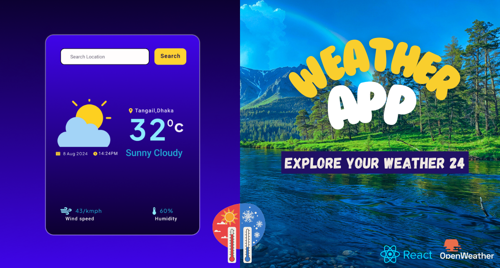

# Weather App 🌤️

This Weather App provides real-time weather updates, including the current time, date, wind speed, temperature, and weather status. The app is designed with - [Figma 🎨](https://www.figma.com/design/CqIyftfsFrxGRLgqlhxgtg/weather-app-ui?node-id=0-1&t=nWwfz9foh1Zx0IHM-1) a user-friendly interface that allows users to access all relevant weather information at a glance. The default location is determined by the user's current location, and users can also search by city name to explore weather conditions in different areas.


## Key Features 🔑

- **Real-Time Weather Updates**: Displays current weather information, including time, date, wind speed, temperature, and weather status.
- **User-Friendly Interface**: Designed to provide easy access to all relevant weather information at a glance.
- **Location-Based Weather**: Automatically shows weather details based on the user's current location.
- **City Search**: Allows users to search by city name to explore weather conditions in different areas.

## Tools and Technologies 🛠️

- [React JS](https://reactjs.org/) used react hook like useState,useEffect
- [CSS](https://developer.mozilla.org/en-US/docs/Web/CSS) for styling
- [Axios JS](https://axios-http.com/) for API requests
- [Moment JS](https://momentjs.com/) for date and time formatting
- [OpenWeather API](https://openweathermap.org/api) for real-time weather data
- [Vite](https://vitejs.dev/) for building and development
- [Vs code](https://code.visualstudio.com/) As a code editor
- [Figma](https://www.figma.com/) for UI design
- [Git](https://git-scm.com/) for version controling system

## To get Figma design files 🎨

- [ Figma design files ](https://www.figma.com/design/CqIyftfsFrxGRLgqlhxgtg/weather-app-ui?node-id=0-1&t=nWwfz9foh1Zx0IHM-1)


## Live 🚀🚀🚀

-- [**Netlify**](https://rad-platypus-eeb4c1.netlify.app/)

## How to contribute in this project ⚙️

### Set up step by step

1. Clone the repository:

   ```bash
   git clone https://github.com/mamun-ethan/Weather-app.git
   ```

2. Navigate to the project directory:

   ```bash
   cd weather-app
   ```

3. Install the dependencies:

   ```bash
   npm install
   ```

4. Create a `.env` file in the root directory of the project:

   ```bash
     touch .env
   ```

5. Open `.env.example` files then copy the placeholder.

6. Paste it in the `.env` fils and replace the placeholder with your actual API keys.

7. Start the development server:
   ```bash
   npm run dev
   ```
